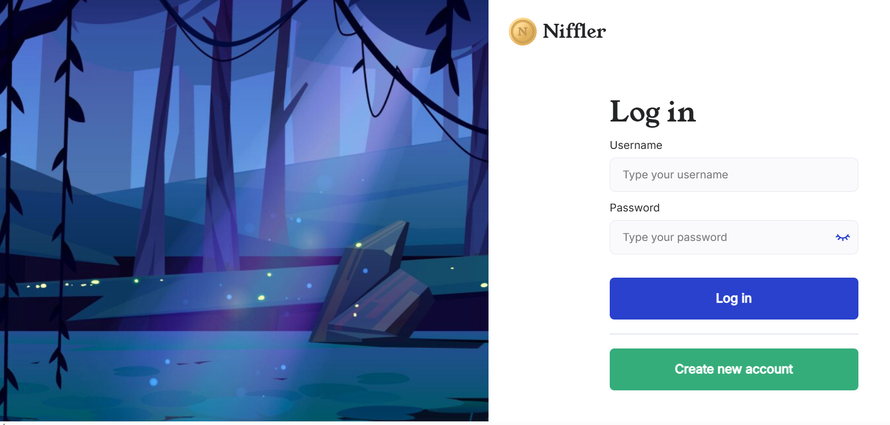

## Фреймворк автоматизированного тестирования приложения Niffler. 

### Особенности фреймворка:  
<p  align="center">
<code></code>
</p>

### Проект реализован с использованием:

<p  align="left">
<code></code>
<code></code>
<code></code>
<code></code>
<code></code>
<code></code>
<code></code>  


### Предустановка
- Запустить Docker локально на компьютере
- Запустить приложение Niffler командой через bash терминал:  
```commandline
bash docker-compose-dev.sh
```
- Создать тестового пользователя с логином паролем   
- Создать и заполнить `.env` в соответствии с примером
- Запустить тесты командой:
```commandline
pytest
```

### Работаем с реляционными базами данных из тестов  

### New branch and project


start pytest coverage:
```commandline
pytest --cov=tests

```