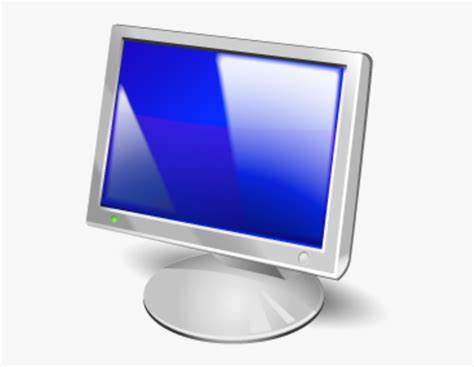
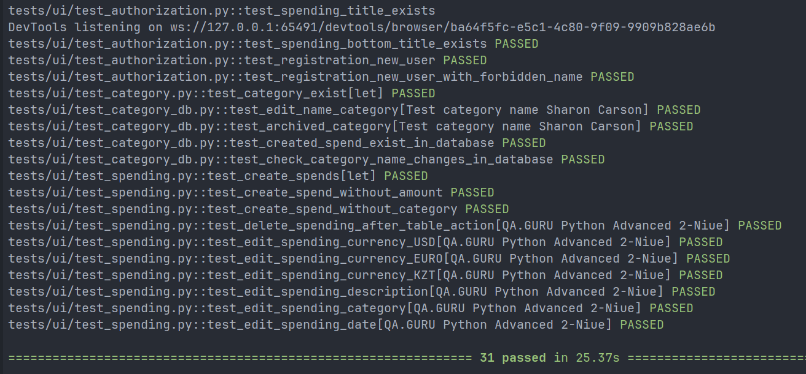
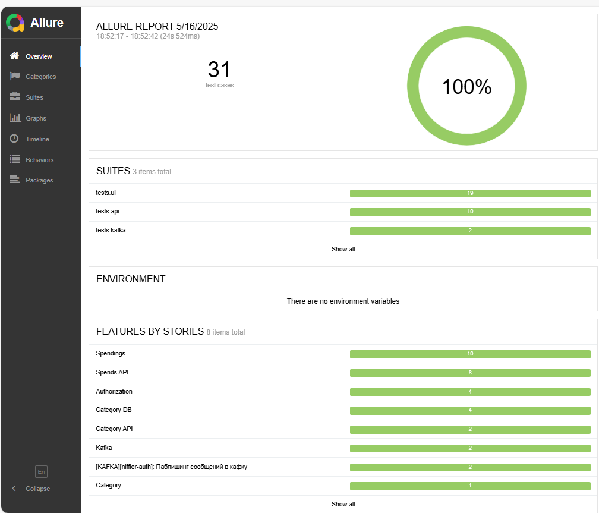
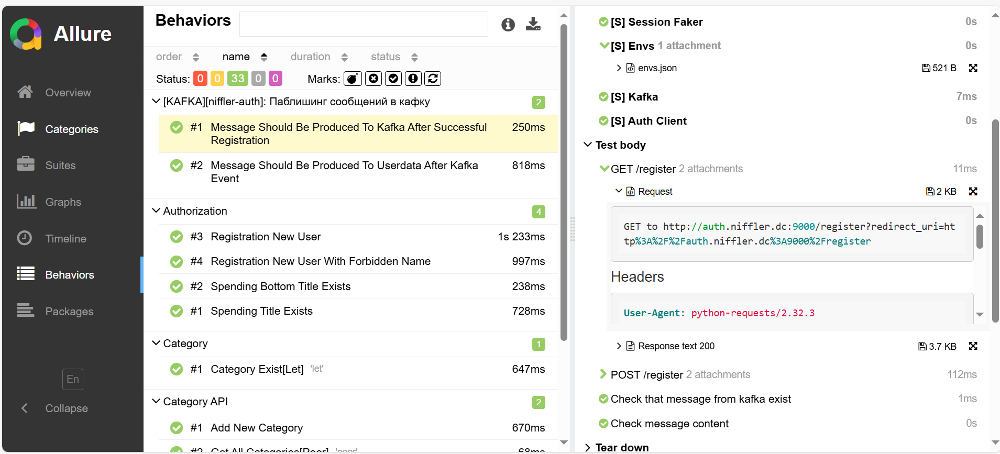
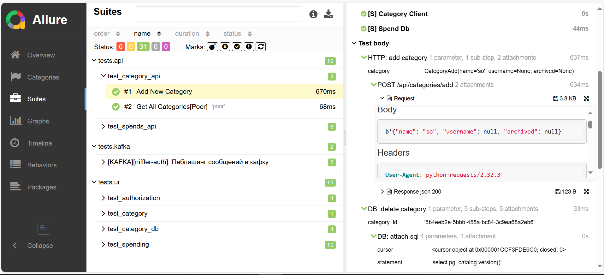

## Проект автоматизированного тестирования приложения Niffler.

<p  align="center">
<code></code>
</p>  

### Проект реализован с использованием:

<p  align="left">
<code></code>
<code></code>
<code></code>
<code></code>
<code></code>
<code></code>  
<code></code>  
<code></code>  
<code></code>  
<code></code> 
</p>

###  Особенности проекта:

* Созданы UI тесты с использованием PageObject и ООП на фреймворке `Selene`
* Созданы UI тесты + DB с использованием передачи данных REST API
* Созданы тесты проверяющие передачу данных REST API + DB
* Созданы Е2Е тесты проверяющие очередь событий KAFKA -> DB -> API
* Для создания отчетов тестирования применен Allure Reports
* Для повышения читаемости отчетов тестирования используется шаблонизатор `Jinja2`
* Для валидации и трансформации данных используется библиотека `Pydantic`
* Для запуска тестов и управлением тестовыми данными созданы специальные фикстуры
* Для управления и вщзаимодействия с БД используется `SQLAlchemy`

###  Локальный запуск тестов

- Скопировать проект на локальную машину
- Запустить Docker локально на компьютере
- Запустить `Niffler` согласно README основного проекта
- Настроить виртуальное окружение проекта

```commandline
python -m venv .venv
source .venv/bin/activate
```

- Установить зависимости проекта из файла `requirements.txt`
- В соответствии с инструкцией установить
  Allure [https://allurereport.org/docs/install/](https://allurereport.org/docs/install/)
- Запустить приложение `Niffler` командой через `bash` терминал:

```commandline
bash docker-compose-dev.sh
```

- Создать тестового пользователя с логином паролем
- Создать и заполнить `.env` в соответствии с примером, добавив созданного тестового пользователя
- Открыть в браузере приложение `Niffler`  - [http://frontend.niffler.dc/](http://frontend.niffler.dc/)
- Зарегистрировать в приложении созданного тестового пользователя
- Запустить тесты командой:

```commandline
pytest --cov=tests
```

<details><summary>Результат прохождения тестов</summary>
<br>

</details>

###  Allure отчет

- Выполнить запрос на формирование отчета  
  note: команда для Windows

```commandline
allure serve
```  

Результат: откроется страница с отчетом Allure Report

<details><summary>Allure report</summary>
<br>



</details>
